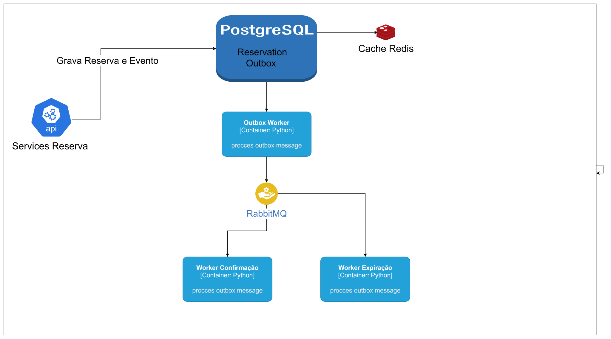

# Desenho de solução:

# Modelagem de dados:

- Product

- Reservation

- Outbox

- Inventory

- User 

# git flow 

    # criar feature
    git checkout -b feat/export-csv
    # commits no padrão
    git commit -m "feat: exporta relatórios em CSV"
    git push -u origin feat/export-csv

    # abrir PR → Squash & Merge na main
    # o action cria PR de release
    # após revisar:
    # merge da PR de release → cria tag e Release com notas

# Todo 

1 - Configurar Swagger  
2 - Analisar possibilidade de usar Poetry 
3 - Implementar pre-commit 
4 - Implementar Black
5 - Implementar Lint 
6 - Implemtar testes de performance
7 - Criar repo no github 

# how to play 

docker-compose up --build -d

Criação de nova versão do banco com alembic 

