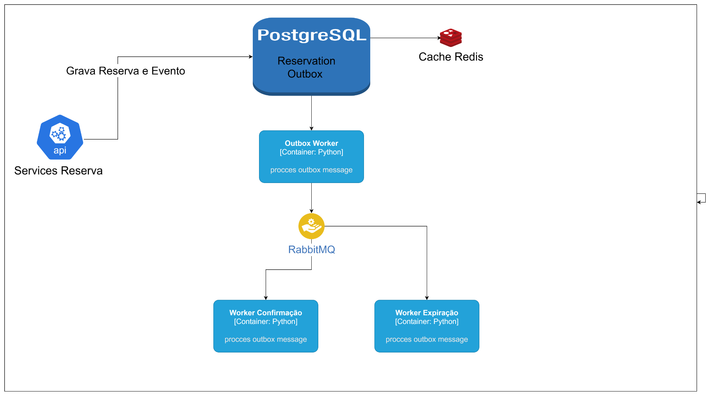
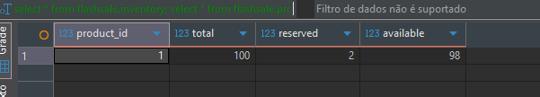
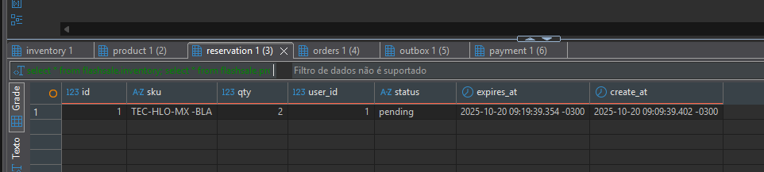
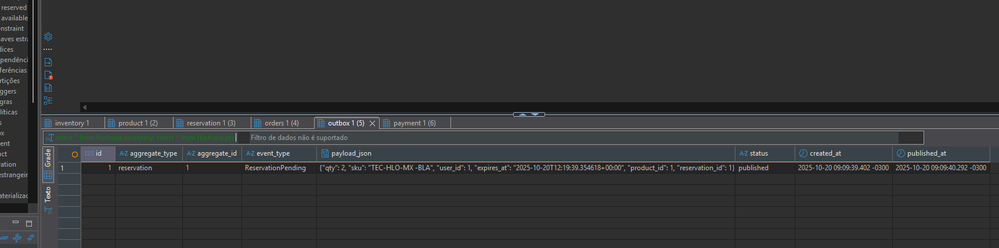
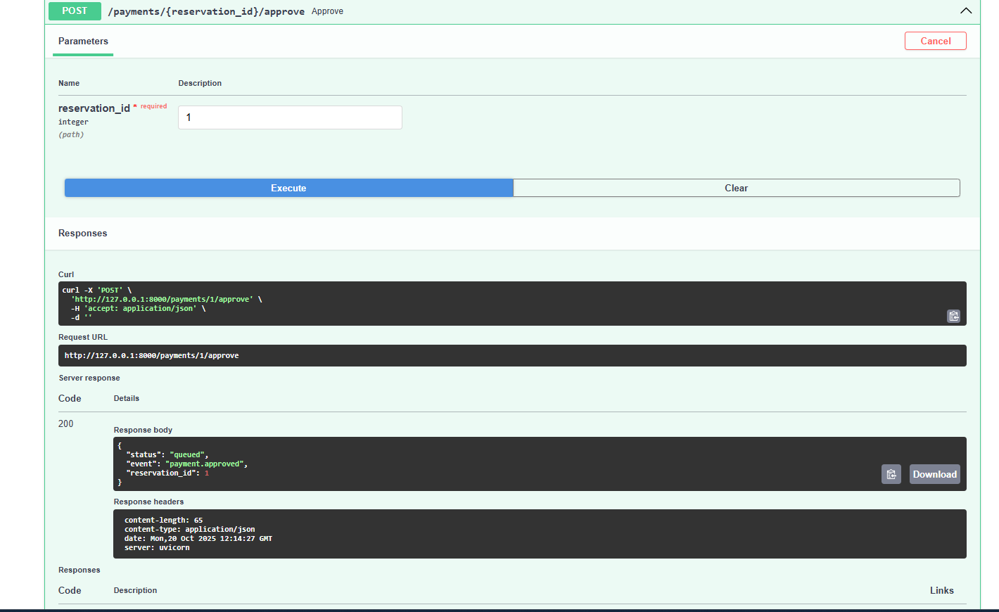
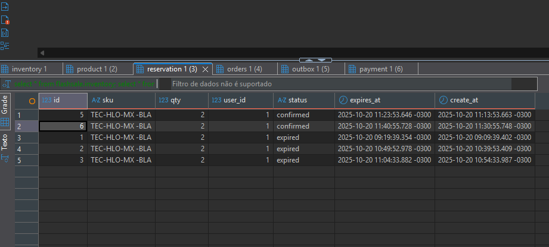

# Desenho de solução:

# Modelagem de dados:

- Product

- Reservation

- Outbox

- Inventory

- User 

# git flow 

    # criar feature
    git checkout -b feat/export-csv
    # commits no padrão
    git commit -m "feat: exporta relatórios em CSV"
    git push -u origin feat/export-csv

    # abrir PR → Squash & Merge na main
    # o action cria PR de release
    # após revisar:
    # merge da PR de release → cria tag e Release com notas

# Todo 

1 - Configurar Swagger  
2 - Analisar possibilidade de usar Poetry 
3 - Implementar pre-commit 
4 - Implementar Black
5 - Implementar Lint 
6 - Implemtar testes de performance
7 - Criar repo no github 

# how to play 

docker-compose up --build -d

Criação de nova versão do banco com alembic 

docker compose exec api alembic revision --autogenerate -m "create outbox table"

Criar as tabelas:

docker compose exec api alembic upgrade head

# How tp update api 

docker compose build api
docker compose up -d api

# endpoint swagger

http://127.0.0.1:8000/docs#/

# endpoint rabitmq
http://localhost:15672/#/

# gerador de sku

https://www.hostgator.com.br/ferramentas/gerador-sku

# Como testei

1- Criei um produto usando o endpoint create product via swagger

Exemplo:

{
  "sku": "TEC-HLO-MX -BLA",
  "name": "Teclado Sem Fio Logitech MX Mechanical",
  "description": "Teclado Mecânico Sem Fio Logitech MX Mechanical Mini, Iluminação, Switch Tactile Quiet, Bluetooth, USB, Preto",
  "price": 969.99
}

2 - Crie o estoque do produto usando o comando abaixo, usei o Dbeaver
Script para criar inventory:

INSERT INTO flashsale.inventory
(product_id, total, reserved, available)
VALUES(1, 100, 0, 100);

3 - Criei uma reserva usando a api reservatios:

{
  "sku": "TEC-HLO-MX -BLA",
  "qty": 2,
  "user_id": 1,
  "status": "string",
  "expires_at": "2025-10-20T12:06:46.184Z"
}

Inventorio alterado

Reserva criada:

Outbox populada:

    

Chamei o endpoint de pagamento passando o reservarion ID criado:

Lista de produtos confirmados e expirados, tudo funcionou :)

